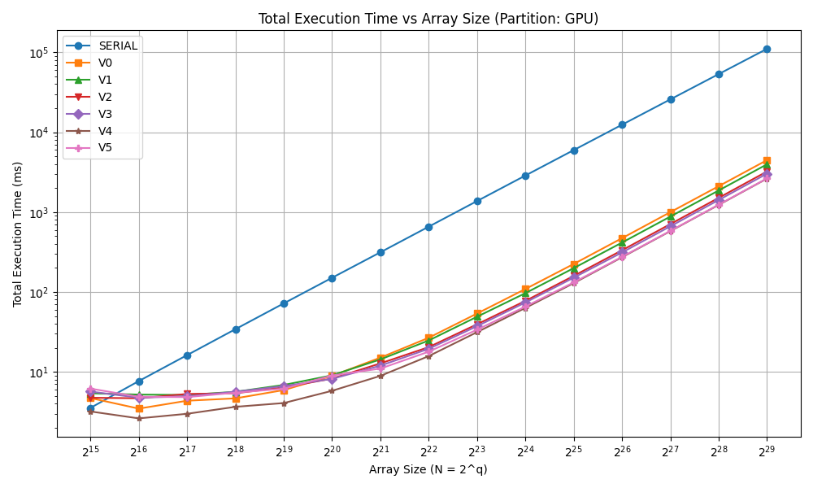
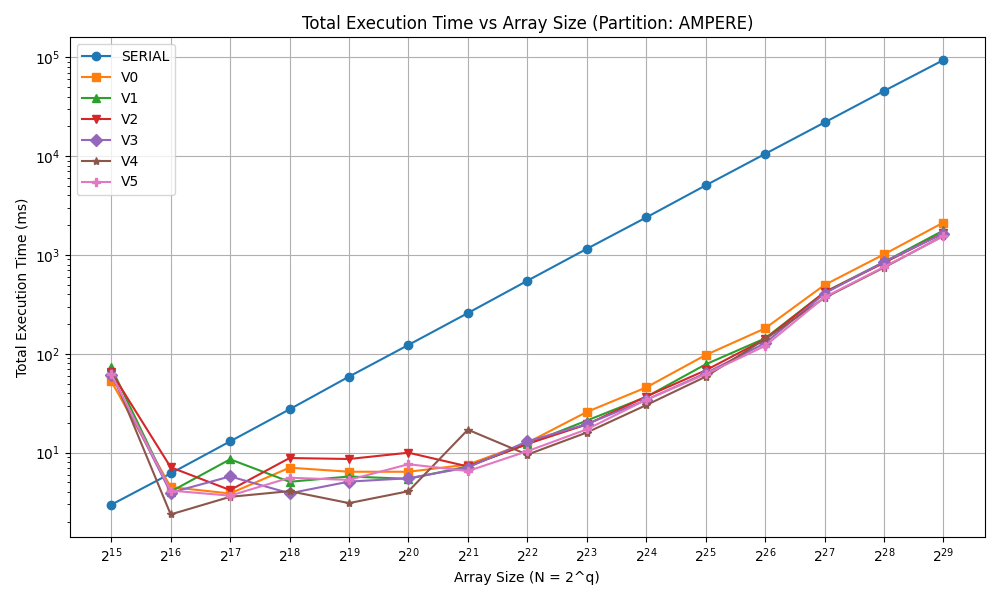

# Bitonic Sort CUDA

This repository contains CUDA implementations of the Bitonic Sort algorithm optimized for GPU 
architectures. The project explores six versions of Bitonic Sort, each progressively improving 
performance by addressing specific GPU programming challenges:

- **V0:** A naive baseline implementation where each thread performs a single comparison step 
using global memory and one kernel launch per sorting step.
- **V1:** Introduces kernel fusion by looping multiple comparison steps within a single kernel, 
reducing kernel launch overhead and improving efficiency.
- **V2:** Utilizes shared memory for intra-block sorting, significantly reducing memory access 
latency compared to global memory.
- **V3:** Leverages warp-level shuffle instructions for intra-warp comparisons, minimizing the
 use of shared memory and synchronization barriers.
- **V4:** Cuts the number of active threads in half to eliminate in-warp branching and idle 
threads, improving thread utilization and execution efficiency.
- **V5:** Applies an indexing technique to reorder shared memory accesses, effectively 
eliminating bank conflicts and maximizing shared memory bandwidth.

This repository is designed for testing, benchmarking, and profiling the Bitonic Sort CUDA implementations on the Aristotelis HPC Cluster, enabling efficient evaluation of performance across multiple GPU architectures.

---

## Table of Contents

- [Project Structure](#project-structure)
- [Version Summary](#version-summary)
- [Performance Comparison](#performance-comparison)
- [Requirements](#requirements)
- [Local Setup](#local-setup)
  - [Running Tests Locally](#running-tests-locally)
  - [Running Benchmarks Locally](#running-benchmarks-locally)
- [Setup on Aristotelis HPC](#setup-on-aristotelis-hpc)
  - [Running Tests on HPC](#running-tests-on-hpc)
  - [Running Benchmarks on HPC](#running-benchmarks-on-hpc)
- [Aknowledgments](#aknowledgements)

---

## Project Structure

- **`benchmarks/`** - Benchmark scripts and performance results (HPC)
- **`debug/`** - Scripts for `memcheck`, `racecheck`, `initcheck` (HPC)
- **`docs/`** - Project report
- **`include/`** - Header files
- **`profile/`** - Nsight Systems profiling scripts (HPC)
- **`src/`** - CUDA source files
- **`tests/`** - Unit test scripts (HPC)
- **`.vscode/`** - VSCode settings

---

## Version Summary

| Version | Optimization                            |
|---------|-----------------------------------------|
| V0      | Naive implementation                    |
| V1      | Fused steps into a single kernel        |
| V2      | Used shared memory for intra-block sort |
| V3      | Warp shuffles for intra-warp sorting    |
| V4      | Half the threads, no warp branching     |
| V5      | Avoided shared memory bank conflicts    |

---

## Performance Comparison

Sorting time for `2^29` 32-bit integers.

**GPU partition**
| Version | Time (ms) | Step Speedup | Total Speedup |
|---------|-----------|---------------|----------------|
| SERIAL  | 110711.37 | --            | 1.00           |
| V0      | 4475.87   | 24.74         | 24.74          |
| V1      | 3967.72   | 1.13          | 27.90          |
| V2      | 3220.96   | 1.23          | 34.37          |
| V3      | 3028.74   | 1.06          | 36.55          |
| V4      | 2627.18   | 1.15          | 42.14          |
| V5      | 2596.56   | 1.01          | 42.63          |

**Ampere partition**
| Version | Time (ms) | Step Speedup | Total Speedup |
|---------|-----------|---------------|----------------|
| SERIAL  | 93705.61  | --            | 1.00           |
| V0      | 2127.30   | 44.05         | 44.05          |
| V1      | 1769.15   | 1.20          | 52.97          |
| V2      | 1672.39   | 1.06          | 56.03          |
| V3      | 1644.31   | 1.02          | 56.99          |
| V4      | 1562.46   | 1.05          | 59.97          |
| V5      | 1543.99   | 1.01          | 60.69          |

Execution time vs array size:

**GPU Partition**

**Ampere Partition**


---

## Requirements

To build and run locally:

### Hardware
- CUDA-capable NVIDIA GPU (Compute Capability >= 6.0 recommended)
- At least 8 GB GPU memory (for large benchmarks)
- Sufficient RAM for allocating large host arrays (up to ~12 GB)

### Software
- CUDA Toolkit (nvcc, libcudart)
- C++ compiler (g++ >= 5.0)
- Make
- Linux or WSL2 (tested on Ubuntu 22.04)

---

## Local Setup

Clone the repository:

```bash
git clone https://github.com/georrous6/bitonic-sort-cuda.git
cd bitonic-sort-cuda
```

Set the `CUDA_HOME` environment variable:

```bash
export CUDA_HOME=/path/to/cuda
```

Build the project (default is `release`):

```bash
make BUILD_TYPE=release
```

Valid build types:
- `release`: optimized binary
- `debug`: debugging symbols and checks enabled

---

### Running Tests Locally

After building:

```bash
cd build/debug
./tests
```

---

### Running Benchmarks Locally

```bash
cd build/release
./benchmarks <q> [options]
```

Where `2^q` is the array size.

**Options:**
- `--version serial|v0|v1|v2|v3|v4|v5` (default: serial)
- `--desc` sort in descending order
- `--timing-file <file>` save timing to file

---

## Setup on Aristotelis HPC

Clone on the HPC:

```bash
git clone https://github.com/georrous6/bitonic-sort-cuda.git
cd bitonic-sort-cuda
```

Or transfer from local:

```bash
scp -r /path/to/bitonic-sort-cuda [user]@aristotle.it.auth.gr:/destination/path/
```

Replace `[user]` with your institutional username.

---

### Running Tests on HPC

```bash
cd tests
chmod +x submit_tests.sh
./submit_tests.sh gpu         # or ampere
```

---

### Running Benchmarks on HPC

```bash
cd benchmarks
chmod +x submit_benchmarks.sh
./submit_benchmarks.sh ampere   # or gpu
```

---

## Aknowledgements
This work was carried out using the computational resources of the Aristotelis HPC Cluster 
at Aristotle University of Thessaloniki.
